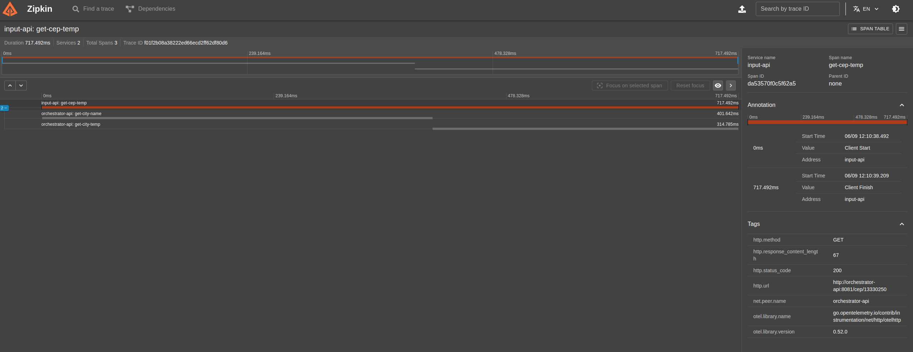

# goexpert-weather-api-otel
Projeto do Laboratório "Tracing distribuído e span" do treinamento GoExpert(FullCycle).


## O desafio
Desenvolver um sistema em Go que receba um CEP, identifica a cidade e retorna o clima atual (temperatura em graus celsius, fahrenheit e kelvin) juntamente com a cidade. Esse sistema deverá implementar OTEL(Open Telemetry) e Zipkin.

Basedo no cenário conhecido "Sistema de temperatura por CEP" denominado Serviço B, será incluso um novo projeto, denominado Serviço A.


## Como rodar o projeto: manual
``` shell
## 1. Clone o repo

## 2. Crie o .env
cp .env.example .env

## 3. Coloque sua api-key como valor na variável OPEN_WEATHERMAP_API_KEY no .env
## ----- ATENÇÃO: estou usando a API https://openweathermap.org/
## 3.1. Se ainda não tiver uma conta, crie uma.
## 3.2. Passe o cursor do mouse sobre o teu nome de usuário, no menu superior à direita
## 3.3. Clique em "My API keys", 
## 3.4. No bloco "Create key", defina um nome para a key e clique em "Generate"

## 4. Baixe compose, se estiver up
docker-compose down

## 5. Remover as imagens antigas, se existirem
docker image rm -f dabraga/input-api:v1
docker image rm -f dabraga/orchestrator-api:v1

## 6. Suba o compose 
docker-compose up -d

## 7. Faça uma chamada no input-api para gerar os traces
echo -e -----------------" input-api -----------------"
echo -n "200: "; curl -s "http://localhost:8080/cep" -d '{"cep": "13330250"}'

## 8. Veja os traces via Zipkin: http://localhost:9411
## DICA: clique sobre o span do input-api para poder ver os spans aninhados do orchestrator-api também
```


## Como rodar o projeto: make
``` shell
## 1. Clone o repo

## 2. Crie o .env
cp .env.example .env

## 3. Coloque sua api-key como valor na variável OPEN_WEATHERMAP_API_KEY no .env
## ----- ATENÇÃO: estou usando a API https://openweathermap.org/
## 3.1. Se ainda não tiver uma conta, crie uma.
## 3.2. Passe o cursor do mouse sobre o teu nome de usuário, no menu superior à direita
## 3.3. Clique em "My API keys", 
## 3.4. No bloco "Create key", defina um nome para a key e clique em "Generate"

## 4. Baixe compose, se estiver up
make down

## 5. Remover as imagens antigas, se existire,
make clean

## 6. Suba o compose 
make up

## 7. Faça uma chamada no input-api para gerar os traces
make call-input-api

## 8. Veja os traces via Zipkin: http://localhost:9411
## DICA: clique sobre o span do input-api para poder ver os spans aninhados do orchestrator-api também
```


## Funcionalidades da Linguagem Utilizadas
- configs: spf13/viper
- graceful-shutdown: os/signal
- tests: stretchr/testify
- web-framework: go-chi
- tracing: opentelemetry
- metrics: prometheus


## Requisitos - Serviço A (responsável pelo input):
- [x] O sistema deve receber um input de 8 dígitos via POST, através do schema:  { "cep": "29902555" }
- [x] O sistema deve validar se o input é valido (contem 8 dígitos) e é uma STRING
- [x] Caso seja válido, será encaminhado para o Serviço B via HTTP
- [x] Caso não seja válido, deve retornar:
    - Código HTTP: 422
    - Mensagem: invalid zipcode


## Requisitos - Serviço B (responsável pela orquestração):
- [x] O sistema deve receber um CEP válido de 8 digitos
- [x] O sistema deve realizar a pesquisa do CEP e encontrar o nome da localização, a partir disso, deverá retornar as temperaturas e formata-lás em: Celsius, Fahrenheit, Kelvin juntamente com o nome da localização.
- [x] O sistema deve responder adequadamente nos seguintes cenários:
    - Em caso de sucesso:
        - Código HTTP: 200
        - Response Body: { "city: "São Paulo", "temp_C": 28.5, "temp_F": 28.5, "temp_K": 28.5 }
    - Em caso de falha, caso o CEP não seja válido (com formato correto):
        - Código HTTP: 422
        - Mensagem: invalid zipcode
    - ​​​Em caso de falha, caso o CEP não seja encontrado:
        - Código HTTP: 404
        - Mensagem: can not find zipcode


# Requisitos - Entrega
- [x] O código-fonte completo da implementação.
- [x] Documentação explicando como rodar o projeto em ambiente dev.
- [x] Utilize docker/docker-compose para que possamos realizar os testes de sua aplicação.


## Traces: Zipkin



## Referências
- https://github.com/open-telemetry/opentelemetry-collector-contrib/tree/main/examples/demo
- https://github.com/openzipkin-attic/docker-zipkin/blob/master/docker-compose.yml
