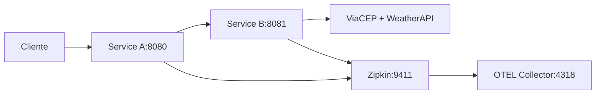

# 🌤️ Weather API com OpenTelemetry

Sistema de microserviços em Go que recebe um CEP e retorna o clima atual com observabilidade completa.

## 🏗️ Arquitetura



- **Service A**: Gateway (validação + roteamento)
- **Service B**: Processador (ViaCEP + WeatherAPI)
- **Observabilidade**: OpenTelemetry + Zipkin

## 🚀 Como Executar

### 1. Configurar

```bash
make setup
# Editar service-b/.env e adicionar WEATHER_API_KEY
```

### 2. Rodar

```bash
# Docker (recomendado)
make docker-up
```

### 3. Testar

```bash
curl -X POST http://localhost:8080/weather \
  -H "Content-Type: application/json" \
  -d '{"cep":"26140040"}'
```

## 📚 API

### POST /weather

```json
{
  "cep": "26140040"
}
```

**Resposta:**

```json
{
  "city": "Belford Roxo",
  "temp_C": 28.5,
  "temp_F": 83.3,
  "temp_K": 301.5
}
```

## 🔍 Observabilidade

- **Zipkin**: <http://localhost:9411>
- **Traces**: Visualizar fluxo entre serviços
- **Spans**: service-a.handle-request → service-b.fetch-weather

## 📸 Evidências de Funcionamento


### ✅ **API Funcionando**

```bash
# Teste com CEP de Belford Roxo
$ curl -X POST http://localhost:8080/weather \
  -H "Content-Type: application/json" \
  -d '{"cep":"26140040"}'

{"city":"Belford Roxo","temp_C":19.1,"temp_F":66.4,"temp_K":292.1}

# Teste com CEP de São Paulo
$ curl -X POST http://localhost:8080/weather \
  -H "Content-Type: application/json" \
  -d '{"cep":"01310100"}'

{"city":"São Paulo","temp_C":13.2,"temp_F":55.8,"temp_K":286.2}
```

### ✅ **Docker Containers Rodando**

```bash
$ docker ps
CONTAINER ID   IMAGE                                              COMMAND                  STATUS                   PORTS
41d9707f953a   fc-pos-golang-lab-weather-api-com-otel-service-a   "./service-a"            Up 2 minutes             0.0.0.0:8080->8080/tcp
41a66a058c5c   fc-pos-golang-lab-weather-api-com-otel-service-b   "./service-b"            Up 3 seconds             0.0.0.0:8081->8081/tcp
6bd4b6c373f7   openzipkin/zipkin:latest                           "start-zipkin"           Up 4 minutes (healthy)   0.0.0.0:9411->9411/tcp
3206162b56f0   otel/opentelemetry-collector:latest                "/otelcol --config=/…"   Up 4 minutes             0.0.0.0:4318->4318/tcp
```

### ✅ **Tracing Distribuído no Zipkin**

**Dependencies View** - Mostra o fluxo entre serviços:

- `service-a` → `service-b` → `viacep.com.br`
- `service-a` → `service-b` → `api.weatherapi.com`

**Trace Details** - Service A (`service-a.handle-request`):

- **Duration**: 886.080ms
- **Spans**: 4 (validate-input, call-service-b, http post)
- **Trace ID**: `29bdf916aa6ffb59eb4c7d9a45431f75`

**Trace Details** - Service B (`service-b.process-weather`):

- **Duration**: 874.980ms  
- **Spans**: 5 (fetch-zipcode, fetch-weather, http calls)
- **Trace ID**: `80ce8bd99de4edc2bf3f425167ec9bc0`

### ✅ **Spans Detalhados Capturados**

**Service A Spans:**

- `service-a.handle-request` (886.080ms)
  - `service-a.validate-input` (473µs)
  - `service-a.call-service-b` (885.424ms)
    - `service-b: http post` (885.224ms)

**Service B Spans:**

- `service-b.process-weather` (874.980ms)
  - `service-b.fetch-zipcode` (463.069ms)
    - `viacep.com.br: http get` (462.803ms)
  - `service-b.fetch-weather` (411.374ms)
    - `api.weatherapi.com: http get` (411.136ms)

### 🌐 **Interfaces Visuais**

- **Zipkin UI**: <http://localhost:9411> - Visualizar traces e dependências
- **API Endpoint**: <http://localhost:8080/weather> - Testar a API diretamente
- **OTEL Collector**: <http://localhost:4318> - Métricas do collector

### 📊 **Métricas de Performance**

- **Tempo Total**: ~886ms (Service A) + ~875ms (Service B)
- **ViaCEP Response**: ~463ms
- **WeatherAPI Response**: ~411ms
- **Validação CEP**: ~473µs (microsegundos)

## 🧪 Testes

```bash
make test
```

## 📁 Estrutura

```bash
├── .docker/               # Configuração OTEL
├── pkg/otel/              # OpenTelemetry compartilhado
├── service-a/             # Gateway
├── service-b/             # Processador
└── docker-compose.yml     # Stack completa
```

## 🚨 Troubleshooting

- **WEATHER_API_KEY**: Configure em `service-b/.env`
- **CEP inválido**: Use 8 dígitos (ex: 26140040)
- **Zipkin**: Verifique <http://localhost:9411>
